<p align="center">
  
</p>

<h1 align="center">Visa Pay UI 2.0</h1>

<p align="center">
A handcrafted fintech UI concept built entirely with HTML, CSS & JavaScript.
<br>
A complete redesign of my original Visa Pay UI project featuring a new Liquid Glass design language, refined interactions and a significantly improved user experience.
</p>

<p align="center">
  
  
  
  
</p>

---

# About

Visa Pay UI started as a simple frontend UI practice project and eventually grew into a complete digital banking interface.

Version 2.0 isn't just an update—it is a complete rebuild. Almost every screen from the original project has been redesigned with a stronger focus on visual consistency, modern fintech aesthetics and overall user experience.

Everything inside this repository has been handcrafted.

- No React
- No Tailwind CSS
- No Bootstrap
- No UI libraries
- No copied templates

Every page, layout, animation, blur effect, transition, card, button and interaction has been designed and developed manually using only HTML, CSS and JavaScript.

---

# Preview

<table>
<tr>
<td></td>
<td>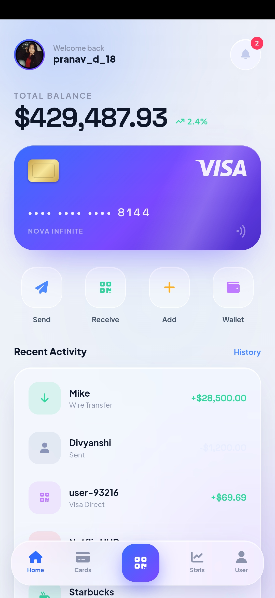</td>
<td>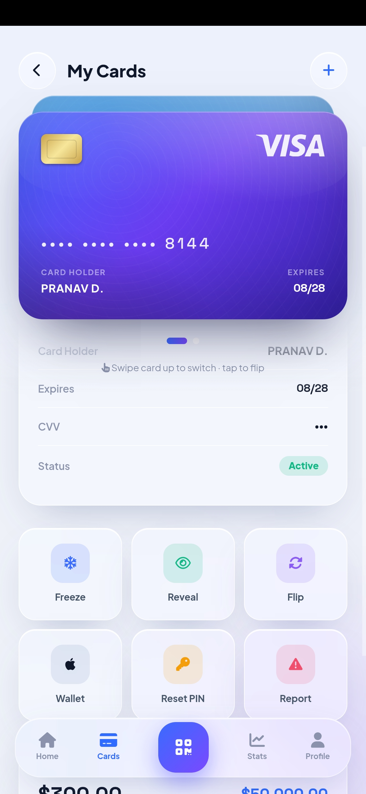</td>
</tr>

<tr>
<td>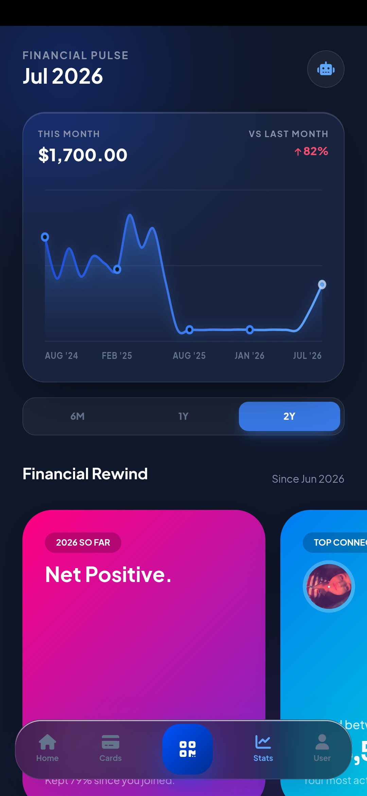</td>
<td>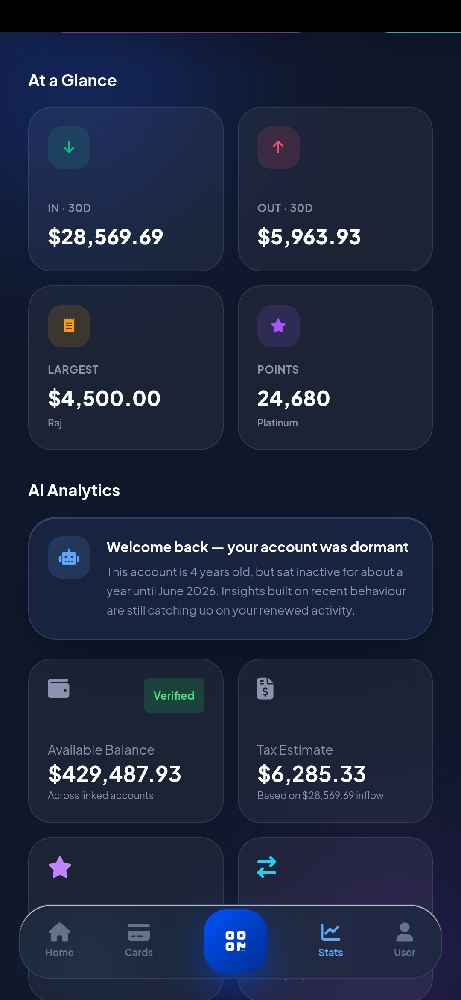</td>
<td>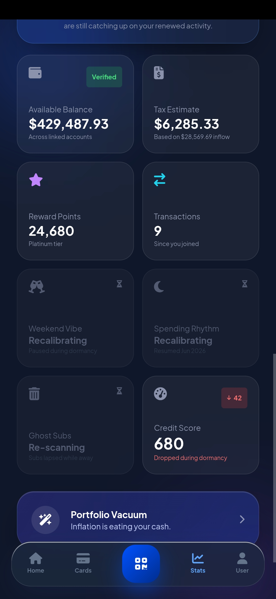</td>
</tr>

<tr>
<td>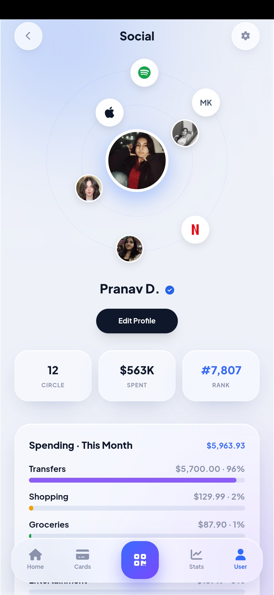</td>
<td>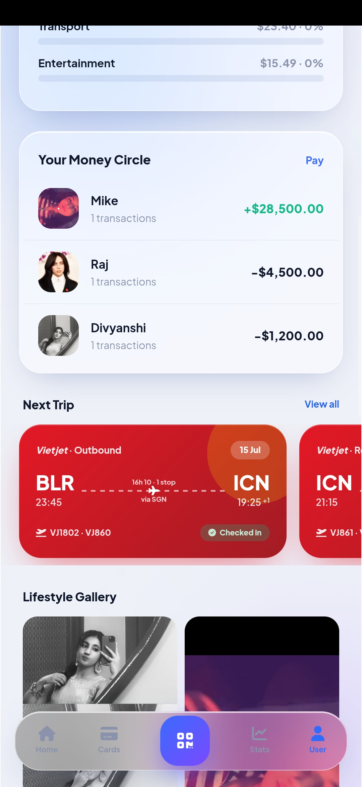</td>
<td>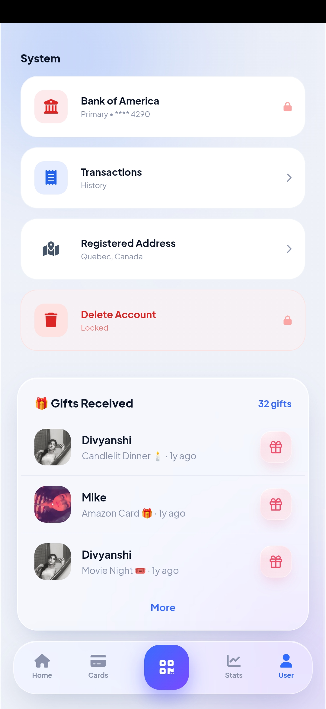</td>
</tr>

<tr>
<td>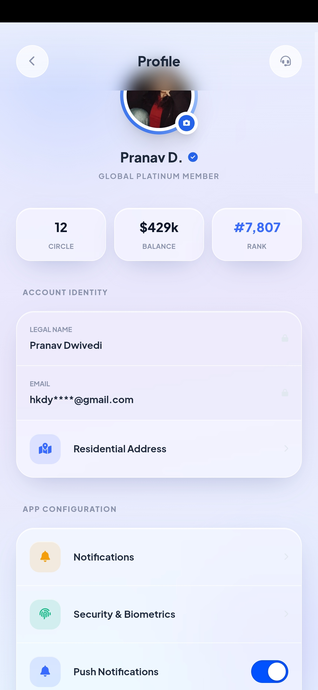</td>
<td>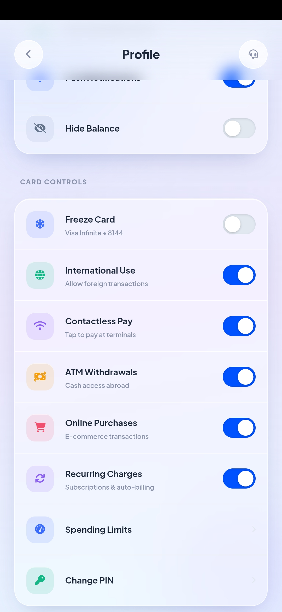</td>
<td>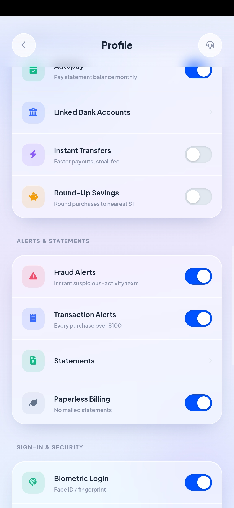</td>
</tr>
</table>

---

# What's New in Version 2.0

- Complete UI redesign
- Liquid Glass inspired design language
- Rebuilt dashboard
- Improved payment experience
- Redesigned banking interface
- Refined profile & settings pages
- New analytics and statistics screens
- Better navigation flow
- Fixed broken links from Version 1
- Improved responsive layouts
- Cleaner project structure
- More consistent spacing
- Better typography
- Handcrafted animations and transitions
- Improved visual hierarchy
- Hundreds of small UI refinements across the application

---

# Features

### Dashboard

- Financial overview
- Balance cards
- Quick actions
- Recent transactions
- Spending insights
- Statistics dashboard

### Payments

- Send Money
- Receive Money
- Wallet Interface
- Tap to Pay
- Payment Sheet
- Transaction History
- Payment Confirmation

### Banking

- Multiple Bank Accounts
- Card Management
- Debit & Credit Cards
- Device Management
- Top Up
- Security Controls

### Finance

- Loan Interface
- Financial Analytics
- Transaction Timeline
- Spending Overview

### Travel

- Flight Booking UI
- Travel Payment Flow
- Booking Cards

### Notifications

- Notification Center
- Interactive Notification Cards
- Status Indicators

### User

- User Profile
- Settings
- Address Management
- Help Center
- Legal Pages
- Preferences

### Admin

- Admin Dashboard
- User Management
- Administrative Controls

### Design

- Liquid Glass UI
- Glassmorphism Components
- Layered Blur Effects
- Smooth Animations
- Interactive Buttons
- Reusable Components
- Modern Typography
- Responsive Layouts
- Consistent Design System

---

# Built With

- HTML5
- CSS3
- Vanilla JavaScript

No frontend frameworks or component libraries were used.

Everything—from the smallest icon placement to complete page layouts—has been built manually.

---

# Version Comparison

| Version 1 | Version 2 |
|------------|------------|
| Initial UI concept | Complete redesign |
| Basic layout | Refined design system |
| Standard interface | Liquid Glass interface |
| Basic navigation | Improved navigation & routing |
| Simple animations | Smoother handcrafted animations |
| Inconsistent pages | Consistent visual language |
| Prototype | More polished application |

---

# Folder Structure

```text
VISA-PAY-2.0
│
├── Visa-Pay-UI-main/
│   ├── css/
│   ├── js/
│   ├── images/
│   ├── screenshots/
│   ├── fonts/
│   ├── pages/
│   └── index.html
│
└── README.md
